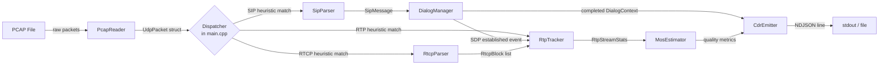

# voipscope — System Design Document

**Version:** 1.0.0  
**Date:** 2026-08-09  
**Status:** DRAFT — ready for developer implementation  
**Based on SRS:** `docs/requirements/SRS.md` v1.0.0-draft (2026-08-09)  
**PM Decisions applied:** OQ-01 through OQ-07

---

## Table of Contents

1. [Architecture Overview](#1-architecture-overview)
2. [Module Breakdown](#2-module-breakdown)
3. [CMake Target Layout](#3-cmake-target-layout)
4. [Key Data Structures](#4-key-data-structures)
5. [SIP Parser Design](#5-sip-parser-design)
6. [Dialog FSM](#6-dialog-fsm)
7. [RTP Correlation Strategy](#7-rtp-correlation-strategy)
8. [Jitter & Loss Algorithm](#8-jitter--loss-algorithm)
9. [MOS Algorithm](#9-mos-algorithm)
10. [CDR Serialisation](#10-cdr-serialisation)
11. [Test Strategy](#11-test-strategy)
12. [Directory Layout](#12-directory-layout)
13. [Dependency Integration Notes](#13-dependency-integration-notes)
14. [Design Decisions & Trade-offs](#14-design-decisions--trade-offs)
15. [Risks](#15-risks)
16. [Missing Requirements Flagged](#16-missing-requirements-flagged)

---

## 1. Architecture Overview

voipscope follows a **linear single-pass pipeline**: PCAP ingestion → protocol parsing → state accumulation → quality computation → CDR emission. There is no second pass over the data; all state is accumulated during the single packet loop (NFR-06 single-threaded).



**Component boundaries:**

| Boundary | Mechanism |
|----------|-----------|
| `PcapReader` → `main` | Returns a `UdpPacket` value struct per call to `next()` |
| `main` → `SipParser` | Passes `std::string_view` of UDP payload |
| `main` → `RtpTracker` / `RtcpParser` | Passes `std::span<const uint8_t>` of UDP payload |
| `DialogManager` → `RtpTracker` | Calls `RtpTracker::associate()` with SDP media address |
| `DialogManager` → `CdrEmitter` | Passes completed `Cdr` value |

---

## 2. Module Breakdown

All modules live in namespace `voipscope`. All types are listed here at interface level only; no implementation code appears in this document.

### 2.1 `src/main.cpp`

Entry point and dispatcher. Responsibilities:

- Parse CLI arguments: `-o/--output <file>`, `-v/--verbose`, `--help`, and the mandatory positional `<pcap-file>`.
- Instantiate `PcapReader`, `DialogManager`, `RtpTracker`, `RtcpParser`, and the output `std::ostream`.
- Drive the main packet loop:
  1. Pull `UdpPacket` from `PcapReader::next()` until EOF.
  2. Classify the payload using a lightweight heuristic (§5.1 for SIP, §7 for RTP/RTCP port ranges).
  3. Dispatch to `SipParser::parseSip()`, then feed the result to `DialogManager::ingest()`.
  4. Or dispatch to `RtpTracker::ingest()` / `RtcpParser::parseRtcp()` + `RtpTracker::ingestRtcp()`.
- On EOF, call `DialogManager::takePending()` to flush incomplete dialogs (OQ-07).
- Collect all terminated dialogs via `DialogManager::takeCompleted()` and emit CDRs via `CdrEmitter::emit()`.
- Set exit code: 0 on success (including zero CDRs), 1 on any fatal error (FR-04).

`main.cpp` owns no protocol-parsing logic. It is intentionally thin so that `voipscope_lib` (which excludes `main.cpp`) can be linked directly by the test suite.

---

### 2.2 `src/pcap/PcapReader` — `.hpp` / `.cpp`

Wraps PcapPlusPlus `IFileReaderDevice`. Public interface:

```
class PcapReader {
public:
    explicit PcapReader(const std::string& path);  // throws std::runtime_error on failure (FR-04)
    std::optional<UdpPacket> next();               // nullopt = EOF; silently skips non-UDP (FR-03)
};

struct UdpPacket {
    std::chrono::system_clock::time_point timestamp;
    std::string  srcIp;
    std::string  dstIp;
    uint16_t     srcPort{0};
    uint16_t     dstPort{0};
    std::vector<uint8_t> payload;
};
```

`PcapReader` is the only module that directly depends on PcapPlusPlus headers. All other modules depend on `UdpPacket`, which is a plain aggregate. This means the PcapPlusPlus dependency can be demoted to `PRIVATE` on `voipscope_lib` if `UdpPacket` is placed in a separate `src/pcap/PcapTypes.hpp` header that does not include PcapPlusPlus.

The **fallback implementation** (`FallbackPcapReader.cpp`, see §13.3) exposes the identical `PcapReader` public interface using raw `libpcap` and manual byte-offset dissection of Ethernet/IPv4/UDP.

---

### 2.3 `src/sip/SipTypes.hpp` — header-only

Defines all SIP-domain value types. No `.cpp`. All types are plain aggregates usable with structured bindings. Pulled in by `SipParser.hpp`, `DialogManager.hpp`, and the test suite.

---

### 2.4 `src/sip/SipParser` — `.hpp` / `.cpp`

Stateless parser with a single public free function:

```
std::optional<SipMessage> parseSip(std::string_view payload);
```

- Uses `std::string_view` cursors internally throughout; zero heap allocation during the parse itself.
- Returns `std::nullopt` for non-SIP payloads and for malformed SIP messages (FR-09).
- The returned `SipMessage` **owns** its data as `std::string` values, so it is safe to store beyond the lifetime of the original UDP buffer.
- Calls `SdpParser::parseSdp()` when `Content-Type: application/sdp` is detected (FR-08).

---

### 2.5 `src/sip/SdpParser` — `.hpp` / `.cpp`

Stateless SDP body parser. Called by `SipParser`; may also be called directly by tests.

```
std::optional<SdpInfo> parseSdp(std::string_view body);
```

Handles FR-17 through FR-19. Returns `std::nullopt` on a body that contains no valid `m=audio` line.

---

### 2.6 `src/sip/DialogManager` — `.hpp` / `.cpp`

Owns the global dialog registry and drives the SIP FSM (FR-10 through FR-16). Key responsibilities:

- Registry: `std::unordered_map<std::string /*call_id*/, DialogContext>`.
- Retransmission cache: per-dialog `std::unordered_set<std::string>` of `"viaBranch/CSeqNumber"` guard strings (CA-08).
- `void ingest(const SipMessage&, std::chrono::system_clock::time_point captureTime, RtpTracker&)` — applies FSM transition, notifies `RtpTracker` on `ESTABLISHED`.
- `std::vector<Cdr> takeCompleted()` — drains dialogs that reached `TERMINATED` via BYE and are ready for CDR emission.
- `std::vector<Cdr> takePending()` — drains dialogs in `ESTABLISHED` at EOF; sets `isIncomplete = true` (OQ-07).

`DialogManager` does **not** depend on `RtpTracker` headers in its own header file; the `RtpTracker&` parameter in `ingest()` keeps the coupling to the `.cpp` only.

---

### 2.7 `src/rtp/RtpParser` — `.hpp` / `.cpp`

Stateless RTP header parser:

```
std::optional<RtpHeader> parseRtp(std::span<const uint8_t> payload);
```

Validates RTP version (must be 2, per RFC 3550 §5.1). Extracts: version, padding flag, extension flag, CC, marker, payload type, sequence number, timestamp, SSRC. Returns `std::nullopt` if the payload is shorter than 12 bytes or the version field is not 2.

---

### 2.8 `src/rtp/RtcpParser` — `.hpp` / `.cpp`

Stateless RTCP compound-packet parser:

```
std::vector<RtcpBlock> parseRtcp(std::span<const uint8_t> payload);
```

Walks compound RTCP packets, recognising SR (PT=200) and RR (PT=201). For each Report Block within an SR or RR, extracts: SSRC of source, fraction lost (8-bit), cumulative packets lost (24-bit), extended highest sequence received, interarrival jitter, LSR, DLSR (FR-25, FR-26). Returns an empty vector on malformed input (consistent with FR-03 silent-skip policy).

---

### 2.9 `src/rtp/RtpTracker` — `.hpp` / `.cpp`

Stateful per-stream accumulator (FR-20 through FR-24, FR-27):

```
class RtpTracker {
public:
    // Called by DialogManager when a dialog reaches ESTABLISHED
    void associate(const std::string& callId,
                   const UdpFiveTuple& callerToCallee,
                   const UdpFiveTuple& calleeToCallee,
                   uint32_t clockRateHz);

    // Called by main for every RTP UDP packet
    void ingest(const UdpPacket& pkt, const RtpHeader& hdr);

    // Called by main for every RTCP RR block
    void ingestRtcp(const RtcpBlock& block);

    // Called by DialogManager to retrieve stats for a completed dialog
    std::vector<RtpStreamStats> getStreams(const std::string& callId) const;
};
```

Internal state:

- `std::unordered_map<std::string /*call_id*/, std::pair<UdpFiveTuple, UdpFiveTuple>>` — registered 5-tuples.
- `std::unordered_map<UdpFiveTuple, RtpStreamStats, UdpFiveTupleHash>` — active stream stats.
- `std::unordered_map<UdpFiveTuple, std::vector<PendingRtpPacket>, UdpFiveTupleHash>` — late-arrival buffer (FR-24), capped at **1000 packets per 5-tuple** to bound memory (NFR-05).

---

### 2.10 `src/quality/MosEstimator` — `.hpp` / `.cpp`

Pure-computation module; no state. All functions are `[[nodiscard]]` free functions:

```
double codecBaselineR(std::string_view codec);
double computeMos(std::string_view codec, double meanJitterMs, double lossPct);
double rToMos(double r);   // exposed separately for unit testing
```

See §9 for exact formulas.

---

### 2.11 `src/output/CdrTypes.hpp` — header-only

Defines `StreamStats` and `Cdr` aggregates. No `.cpp`.

---

### 2.12 `src/output/CdrEmitter` — `.hpp` / `.cpp`

Serialises `Cdr` to NDJSON using `nlohmann::json`:

```
void emit(const Cdr& cdr, std::ostream& out);
```

Handles: `std::optional<T>` → JSON `null`, `streams` array, `"status"` field, ISO 8601 UTC timestamp formatting. Each call writes exactly one JSON object followed by `'\n'` (FR-41). See §10 for full field mapping.

---

## 3. CMake Target Layout

```
voipscope            (executable)
└── voipscope_lib    (STATIC library — all .cpp except main.cpp)
    ├── PcapPlusPlus (PRIVATE — see §13.2 for exact target name)
    └── nlohmann_json::nlohmann_json  (PRIVATE)

voipscope_tests      (executable, GoogleTest runner)
├── voipscope_lib    (same static lib)
└── GTest::gtest_main
```

**Pseudo-CMake (illustrative — developer fills exact syntax):**

```cmake
# Root CMakeLists.txt

cmake_minimum_required(VERSION 3.20)
project(voipscope VERSION 1.0.0 LANGUAGES CXX)

set(CMAKE_CXX_STANDARD 20)
set(CMAKE_CXX_STANDARD_REQUIRED ON)
set(CMAKE_CXX_EXTENSIONS OFF)

add_compile_options(-Wall -Wextra -Wpedantic)

include(cmake/FetchDependencies.cmake)

add_library(voipscope_lib STATIC
    src/pcap/PcapReader.cpp
    src/sip/SipParser.cpp
    src/sip/SdpParser.cpp
    src/sip/DialogManager.cpp
    src/rtp/RtpParser.cpp
    src/rtp/RtcpParser.cpp
    src/rtp/RtpTracker.cpp
    src/quality/MosEstimator.cpp
    src/output/CdrEmitter.cpp
)
target_include_directories(voipscope_lib PUBLIC src/)
target_link_libraries(voipscope_lib
    PRIVATE
        PcapPlusPlus              # see §13.2 for confirmed target name
        nlohmann_json::nlohmann_json
)

add_executable(voipscope src/main.cpp)
target_link_libraries(voipscope PRIVATE voipscope_lib)

enable_testing()
add_subdirectory(tests)
```

```cmake
# tests/CMakeLists.txt

add_executable(voipscope_tests
    test_sip_parser.cpp
    test_dialog_fsm.cpp
    test_jitter.cpp
    test_mos.cpp
    test_cdr.cpp
    test_integration.cpp
)
target_link_libraries(voipscope_tests
    PRIVATE
        voipscope_lib
        GTest::gtest_main
)
target_compile_definitions(voipscope_tests PRIVATE
    FIXTURE_DIR="${CMAKE_CURRENT_SOURCE_DIR}/fixtures"
)
include(GoogleTest)
gtest_discover_tests(voipscope_tests)
```

**Visibility rationale:**

- `PcapPlusPlus` and `nlohmann_json::nlohmann_json` are `PRIVATE` on `voipscope_lib` because no PcapPlusPlus or nlohmann types appear in `voipscope_lib`'s public headers. `UdpPacket` is a plain `std::vector`-based struct; `CdrEmitter.hpp` does not expose `nlohmann::json` types. If this invariant is violated during implementation, bump the affected dependency to `PUBLIC`.
- `GTest::gtest_main` is `PRIVATE` to `voipscope_tests`.

---

## 4. Key Data Structures

All types are in namespace `voipscope`. The following are pseudo-C++ struct declarations — not final implementation code.

### 4.1 `SipMethod` and `SipMessage`

```cpp
// src/sip/SipTypes.hpp

enum class SipMethod {
    INVITE, ACK, BYE, CANCEL, OPTIONS, REGISTER, Unknown
};

struct SipMessage {
    // --- Request fields (zero/empty for responses) ---
    SipMethod   method{SipMethod::Unknown};
    std::string requestUri;   // "sip:bob@example.com"

    // --- Response fields (zero for requests) ---
    int         statusCode{0};
    std::string reasonPhrase;

    // --- Mandatory headers (FR-06, FR-07) ---
    std::string callId;
    std::string from;         // full From: header value
    std::string fromTag;      // extracted tag= parameter
    std::string to;           // full To: header value
    std::string toTag;        // extracted tag= parameter (empty in initial requests)
    uint32_t    cseqNumber{0};
    SipMethod   cseqMethod{SipMethod::Unknown};
    std::string viaBranch;    // branch= param of topmost Via (retransmission key)

    // --- Optional headers ---
    std::string contact;
    std::string contentType;
    uint32_t    contentLength{0};

    // --- Parsed body ---
    std::optional<SdpInfo> sdp;   // populated when Content-Type: application/sdp

    bool isRequest()  const { return statusCode == 0; }
    bool isResponse() const { return !isRequest(); }
};
```

### 4.2 `SdpInfo`

```cpp
struct SdpInfo {
    std::string connectionAddress;  // from c= line (IPv4 dotted-decimal)
    uint16_t    mediaPort{0};       // from m= line first port value
    std::string mediaType;          // "audio" (others ignored per CA-01 scope)
    uint8_t     payloadType{0};     // first PT in m= line (OQ-02: first only)
    std::string codecName;          // from a=rtpmap or static PT table (FR-19)
    uint32_t    clockRateHz{8000};  // from a=rtpmap or codec default
};
```

### 4.3 `DialogKey`

```cpp
struct DialogKey {
    std::string callId;
    std::string fromTag;
    std::string toTag;   // empty string during TRYING / RINGING

    bool operator==(const DialogKey&) const = default;
};

struct DialogKeyHash {
    std::size_t operator()(const DialogKey& k) const noexcept;
    // Implementation: combine hash(callId) ^ rotl(hash(fromTag), 17) ^ rotl(hash(toTag), 31)
};
```

> **Design note — primary lookup key:** Because call forking is explicitly out of scope (OQ-05), the `DialogManager` registry uses `call_id` alone as its `unordered_map` key. `DialogKey` is stored inside `DialogContext` for tag validation and CDR emission; it is not the actual map key. This is explicitly a v1.0 simplification.

### 4.4 `DialogState` and `DialogContext`

```cpp
enum class DialogState {
    IDLE,           // not yet used (implicit; no entry in the map)
    TRYING,         // INVITE seen, no 200 OK yet
    RINGING,        // 180 or 183 received
    ESTABLISHED,    // 200 OK to INVITE received
    TERMINATED      // BYE, error response, or CANCEL received
};

struct DialogContext {
    DialogKey    key;
    DialogState  state{DialogState::TRYING};   // TRYING is the initial state on creation

    std::string  callerUri;    // From AOR (e.g. "sip:alice@example.com")
    std::string  calleeUri;    // To AOR

    // SDP from INVITE offer and 200 OK answer
    std::optional<SdpInfo> offerSdp;    // set on initial INVITE
    std::optional<SdpInfo> answerSdp;   // set on 200 OK to INVITE

    // Packet capture timestamps
    std::chrono::system_clock::time_point inviteTime;
    std::chrono::system_clock::time_point startTime;   // 200 OK timestamp (FR-15)
    std::chrono::system_clock::time_point endTime;     // BYE / error timestamp (FR-15)

    // Retransmission deduplication (CA-08): "viaBranch/CSeqNumber" strings
    std::unordered_set<std::string> seenTransactions;

    // Associated RTP SSRCs (populated by RtpTracker after ESTABLISHED)
    std::vector<uint32_t> ssrcs;

    bool emitCdr{false};       // true = reached TERMINATED via BYE (not just error)
    bool isIncomplete{false};  // true = terminated by EOF rather than BYE (OQ-07)
};
```

### 4.5 `UdpFiveTuple`

```cpp
struct UdpFiveTuple {
    std::string srcIp;
    std::string dstIp;
    uint16_t    srcPort{0};
    uint16_t    dstPort{0};
    // protocol is always UDP; omitted for simplicity

    bool operator==(const UdpFiveTuple&) const = default;
};

struct UdpFiveTupleHash {
    std::size_t operator()(const UdpFiveTuple&) const noexcept;
};
```

### 4.6 `RtpHeader`

```cpp
struct RtpHeader {
    uint8_t  version{0};
    bool     padding{false};
    bool     extension{false};
    uint8_t  csrcCount{0};
    bool     marker{false};
    uint8_t  payloadType{0};
    uint16_t sequenceNumber{0};
    uint32_t timestamp{0};
    uint32_t ssrc{0};
};
```

### 4.7 `RtpStreamStats`

```cpp
struct RtpStreamStats {
    uint32_t ssrc{0};
    uint32_t clockRateHz{8000};
    std::string direction;       // "caller_to_callee" or "callee_to_caller"

    // Sequence tracking (16-bit with wraparound, §8.1)
    uint16_t firstSeq{0};
    uint16_t highestSeq{0};
    uint32_t receivedCount{0};
    bool     seenFirst{false};

    // Jitter accumulator (RFC 3550 §A.8, in RTP clock units)
    double   jitter{0.0};        // running J estimate
    double   jitterSum{0.0};     // cumulative sum of all J_i for mean
    int64_t  prevTransit{0};     // transit value of previous packet
    bool     hasTransit{false};  // false until second packet

    // Timestamp of most recent packet (for transit calculation)
    std::chrono::system_clock::time_point lastArrival;

    // RTCP-supplied authoritative loss (FR-31)
    std::optional<uint32_t> rtcpCumulativeLost;

    // Derived metrics — computed lazily at CDR time
    double meanJitterMs() const;
    double lossPercent()  const;
};
```

### 4.8 `RtcpBlock`

```cpp
struct RtcpBlock {
    uint32_t senderSsrc{0};      // SSRC of SR/RR sender
    uint32_t sourceSsrc{0};      // SSRC of the stream being reported on
    uint8_t  fractionLost{0};
    uint32_t cumulativeLost{0};  // 24-bit field, stored in 32-bit
    uint32_t extHighestSeq{0};
    uint32_t jitter{0};          // interarrival jitter in RTP clock units
    uint32_t lsr{0};             // last SR timestamp
    uint32_t dlsr{0};            // delay since last SR
};
```

### 4.9 `StreamStats` and `Cdr`

```cpp
// src/output/CdrTypes.hpp

struct StreamStats {
    std::string  direction;        // "caller_to_callee" or "callee_to_caller"
    uint32_t     ssrc{0};
    double       mos{0.0};
    double       meanJitterMs{0.0};
    double       lossPercent{0.0};
};

struct Cdr {
    std::string  callId;
    std::string  caller;           // From AOR
    std::string  callee;           // To AOR
    std::chrono::system_clock::time_point startTime;
    std::chrono::system_clock::time_point endTime;

    std::string  codec;            // negotiated codec name
    uint8_t      payloadType{0};   // negotiated RTP payload type

    // Per-stream quality (0, 1, or 2 entries; empty → null top-level fields)
    std::vector<StreamStats> streams;

    // Top-level convenience fields — null when streams is empty (CA-07)
    std::optional<double>   mos;
    std::optional<double>   meanJitterMs;
    std::optional<double>   lossPercent;
    std::optional<uint32_t> ssrc;

    std::string  status{"complete"};   // "complete" or "incomplete" (OQ-07)
};
```

---

## 5. SIP Parser Design

### 5.1 Message Identification Heuristic

Before invoking the full parser, `main.cpp` applies a two-step heuristic to the raw UDP payload:

1. **Response:** payload begins with `"SIP/"` (4 bytes).
2. **Request:** payload begins with one of the known method tokens followed by a space: `"INVITE "`, `"ACK "`, `"BYE "`, `"CANCEL "`, `"OPTIONS "`, `"REGISTER "`.

Payloads failing both checks are skipped silently (FR-03). This check is O(1) and avoids invoking the parser on every non-SIP UDP packet.

### 5.2 Line-Oriented Parsing Strategy

SIP message format (RFC 3261 §7):
```
[request-line | status-line] CRLF
*( header-field CRLF )
CRLF
[ message-body ]
```

`parseSip()` uses a `std::string_view` cursor that advances through the payload without copying:

**Step 1 — First line:**  
Split on the first `"\r\n"`. If the line starts with `"SIP/"`, parse as status-line: `SIP/2.0 <statusCode> <reasonPhrase>`. Otherwise parse as request-line: `<method> <requestUri> SIP/2.0`.

**Step 2 — Header loop:**  
Advance line by line. Implement **header folding** (RFC 3261 §7.3.1): if the next line starts with `' '` (SP) or `'\t'` (HT), it is a continuation of the current header; append it (normalised to a single space) before storing.

Headers are stored in a local flat list of `(name, value)` pairs. After the loop, the required headers are extracted by case-insensitive name comparison. Compact form `"From:"` and space form `"From :"` are both handled per RFC 3261 §7.3.

**Step 3 — Blank line:**  
Detected by `"\r\n\r\n"`. Everything before it is headers; everything after is the body.

**Step 4 — Body:**  
Take exactly `Content-Length` bytes after the blank line. If the payload is shorter than required, return `std::nullopt` (malformed, FR-09).

**Step 5 — Mandatory header check (FR-09):**  
If any of `From`, `To`, `Call-ID`, `CSeq` are absent after parsing, return `std::nullopt`.

**Step 6 — SDP dispatch (FR-08):**  
If `Content-Type` contains `"application/sdp"` (case-insensitive substring match), pass the body `string_view` to `SdpParser::parseSdp()` and store the result in `SipMessage::sdp`.

### 5.3 Tag and Via Branch Extraction

**From/To tag:** Search for `";tag="` in the header value (case-insensitive). Extract the value up to the next `';'` or end-of-string. Trim any surrounding whitespace.

**Via branch:** Search the topmost `Via:` header value for `";branch="` (case-insensitive). Extract up to the next `';'` or end-of-string. Per RFC 3261 §8.1.1.7, the magic cookie prefix `"z9hG4bK"` signals an RFC 3261 compliant branch; accept any value.

**CSeq parsing:** Split the `CSeq:` header value on the first space. First token is the numeric sequence number (parsed as `uint32_t`); second token is the method name.

### 5.4 SDP Parsing (`SdpParser`)

`parseSdp()` scans the body with a `std::string_view` line iterator. State machine tracks whether a `m=audio` line has been seen:

| Line prefix | Action |
|-------------|--------|
| `c=IN IP4 ` | Store remainder as `connectionAddress` |
| `m=audio `  | Parse second token as `mediaPort`; extract first payload type from remaining tokens; set `mediaType = "audio"` |
| `m=video ` or `m=` other | Skip (non-audio media ignored) |
| `a=rtpmap:<pt> <codec>/<rate>` | If `<pt>` matches the stored `payloadType`, set `codecName` and `clockRateHz` |
| `a=fmtp:` | Recognised, not stored (v1.0) |
| `v=`, `o=`, `s=`, `t=` | Recognised, ignored |

**Static payload type table (FR-19):** Applied after scanning if `codecName` is still empty:

| PT | codecName | clockRateHz |
|----|-----------|-------------|
| 0  | PCMU      | 8000        |
| 8  | PCMA      | 8000        |
| 9  | G722      | 8000        |
| 18 | G729      | 8000        |

> **Note on G.722 clock rate:** RFC 3551 §4.5.2 specifies G.722's RTP clock rate as 8000 Hz even though the actual sample rate is 16 kHz. The table above and all jitter-to-ms conversions for G.722 must use 8000 Hz. See §16 item 1.

### 5.5 Retransmission Detection (CA-08)

For each incoming `SipMessage`, a guard string is constructed as `"<viaBranch>/<cseqNumber>"`. This string is looked up in `DialogContext::seenTransactions` (an `unordered_set<string>`). If found, the message is discarded before any FSM transition. If not found, the guard string is inserted and processing continues.

This approach correctly deduplicates UDP retransmissions of the same SIP transaction without requiring timer state.

---

## 6. Dialog FSM

### 6.1 State Transition Table

| Current State | Trigger | Match Condition | Next State | Side Effects |
|---------------|---------|-----------------|------------|--------------|
| *(absent)* | INVITE request | New `call_id` | **TRYING** | Create `DialogContext`; store `offerSdp`; record `inviteTime` |
| TRYING | 180 or 183 response | Matching `call_id` + `cseqNumber` (INVITE) | **RINGING** | — |
| TRYING | 200 OK | Matching `call_id` + `cseqNumber` (INVITE) | **ESTABLISHED** | Store `answerSdp`; record `startTime`; call `RtpTracker::associate()` |
| RINGING | 200 OK | Matching `call_id` + `cseqNumber` (INVITE) | **ESTABLISHED** | Same as above |
| TRYING | 4xx / 5xx / 6xx | Matching `call_id` + `cseqNumber` | **TERMINATED** | Record `endTime`; `emitCdr = false` (FR-40) |
| RINGING | 4xx / 5xx / 6xx | Matching `call_id` + `cseqNumber` | **TERMINATED** | Same as above |
| TRYING | CANCEL | Matching `call_id` | **TERMINATED** | `emitCdr = false` (FR-40) |
| RINGING | CANCEL | Matching `call_id` | **TERMINATED** | `emitCdr = false` (FR-40) |
| ESTABLISHED | BYE request | Matching `call_id` | **TERMINATED** | Record `endTime`; `emitCdr = true` |
| ESTABLISHED | 200 OK | Matching `call_id`, `cseqMethod == BYE` | **TERMINATED** | Record `endTime`; `emitCdr = true` |
| ESTABLISHED | INVITE (re-INVITE) | Same `call_id`; `cseqNumber` > original | **ESTABLISHED** | Update `offerSdp` in-place (FR-16); no new dialog |
| ESTABLISHED | 200 OK (re-INVITE) | Same `call_id`; `cseqMethod == INVITE`; higher CSeq | **ESTABLISHED** | Update `answerSdp`; call `RtpTracker::associate()` with new SDP |

Events not listed for a given state (e.g., INVITE in TRYING) are silently discarded.

### 6.2 FSM Diagram

```
              ┌──────────────────────────────────────────────────┐
              │         [new Call-ID INVITE]                      │
              ▼                                                    │
         ┌─────────┐                                              │
         │ TRYING  │──────────────────────────────────────┐       │
         └────┬────┘  4xx/5xx/6xx or CANCEL               │       │
              │ 180/183                                    │       │
         ┌────▼────┐                                      │       │
         │ RINGING │──────────────────────────────────┐   │       │
         └────┬────┘  4xx/5xx/6xx or CANCEL           │   │       │
              │ 200 OK to INVITE                       │   │       │
     ┌────────▼──────────────────────────────────┐    │   │       │
     │             ESTABLISHED                   │◄───┘   │       │
     │   [re-INVITE loops back to ESTABLISHED]  │        │       │
     └────────────────────────┬──────────────────┘        │       │
                               │ BYE or 200 OK to BYE     │       │
                          ┌────▼──────────┐                │       │
                          │  TERMINATED   │◄───────────────┘       │
                          └───────────────┘                        │
                                                                   │
  Note: TRYING → ESTABLISHED direct path (no 180/183) is valid ───┘
```

### 6.3 Re-INVITE Handling (FR-16)

A re-INVITE is detected when:
1. An INVITE request arrives with a `call_id` that already exists in the registry **and** the dialog is in `ESTABLISHED` state.
2. The new `cseqNumber` is greater than the `cseqNumber` of the original INVITE.

Action: update `DialogContext::offerSdp` in-place. When the 200 OK to this re-INVITE arrives (same `call_id` + matching `cseqNumber`), update `answerSdp` and call `RtpTracker::associate()` again with the new media address (the remote endpoint may have changed ports mid-call). The dialog state remains `ESTABLISHED` throughout.

No new `DialogContext` is created; exactly one CDR is emitted per call (FR-16).

### 6.4 EOF Handling (OQ-07)

After `PcapReader::next()` returns `std::nullopt` (EOF):
- `DialogManager::takeCompleted()` drains `emitCdr == true` entries → CDR emitted normally.
- `DialogManager::takePending()` drains dialogs in `ESTABLISHED` state:
  - Sets `isIncomplete = true`.
  - Sets `endTime` to the capture timestamp of the last RTP packet seen for the dialog's streams (or `inviteTime` if no RTP arrived).
  - CDR emitted with `"status": "incomplete"`.
- Dialogs in `TRYING` or `RINGING` at EOF are silently discarded (FR-40).

---

## 7. RTP Correlation Strategy

### 7.1 5-Tuple Registration

When `DialogManager` transitions a dialog to `ESTABLISHED`, it calls `RtpTracker::associate()` with two `UdpFiveTuple` values derived from the offer/answer SDP:

**Caller→Callee direction:**
- `srcIp = offerSdp.connectionAddress`, `srcPort = offerSdp.mediaPort`
- `dstIp = answerSdp.connectionAddress`, `dstPort = answerSdp.mediaPort`

**Callee→Caller direction:**
- `srcIp = answerSdp.connectionAddress`, `srcPort = answerSdp.mediaPort`
- `dstIp = offerSdp.connectionAddress`, `dstPort = offerSdp.mediaPort`

`RtpTracker` stores both 5-tuples in its registry, keyed by `call_id`.

### 7.2 Per-Packet Processing

For each RTP `UdpPacket`:
1. Construct a `UdpFiveTuple` from `srcIp`, `srcPort`, `dstIp`, `dstPort`.
2. Look up in the registered 5-tuple map.
3. If found: route to the corresponding `RtpStreamStats` entry (keyed by `(5-tuple, ssrc)` for SSRC disambiguation per FR-22).
4. If not found: buffer in the pending map.

SSRC disambiguation: two RTP packets with the same 5-tuple but different SSRC values create separate `RtpStreamStats` entries. In the standard two-party call, each direction has exactly one SSRC.

### 7.3 Late-Arrival Buffering (FR-24)

```
pending_: unordered_map<UdpFiveTuple, vector<PendingRtpPacket>>
```

`PendingRtpPacket` stores `{RtpHeader, captureTimestamp}`.

On `associate()`, `RtpTracker` looks up both 5-tuples in `pending_`. For each buffered packet found, it is replayed — in capture order — into the newly created `RtpStreamStats`. The pending entry is then erased.

**Memory cap:** Each pending 5-tuple vector is capped at **1000 packets** (approximately 20 seconds of G.711 at 50 pps). Packets exceeding the cap are dropped with a `--verbose` warning.

### 7.4 RTCP Association (FR-25, FR-26, FR-27)

RTCP packets arrive on the RTP port + 1 (conventional, not enforced by the standard). The heuristic in `main.cpp` checks whether a UDP packet on any port could be RTCP by attempting `RtcpParser::parseRtcp()` and checking whether PT=200 or PT=201 is the first packet type in the compound.

On success, for each `RtcpBlock`, `RtpTracker::ingestRtcp()` looks up the `sourceSsrc` in the active stream map and updates `RtpStreamStats::rtcpCumulativeLost`. The RTCP interarrival jitter field is stored for diagnostic purposes but the authoritative jitter for the CDR is always the RFC 3550 §A.8 running estimator computed from the RTP stream itself.

---

## 8. Jitter & Loss Algorithm

### 8.1 Jitter Computation (FR-28, FR-29)

Implements RFC 3550 §A.8 running estimator exactly.

**Per-packet update (for packet i, i ≥ 2):**

$$
\text{transit}_i = \left(\frac{\text{arrivalWallClock}_i \text{ [ns]}}{10^9} \cdot \text{clockRateHz}\right) - \text{rtpTimestamp}_i
$$

$$
D_i = \left| \text{transit}_i - \text{transit}_{i-1} \right|
$$

$$
J_i = J_{i-1} + \frac{D_i - J_{i-1}}{16}
$$

- $J$ is initialised to 0.0.
- The first packet records `prevTransit` and contributes no update ($J$ stays 0).
- `arrivalWallClock` is taken from `UdpPacket::timestamp` (PCAP capture time).

**Pseudocode:**

```
on packet i:
    arrivalUnits = timestamp_ns(pkt.arrivalTime) / 1e9 * clockRateHz
    transit      = (int64_t)arrivalUnits - (int64_t)rtp.timestamp
    if hasTransit:
        D = abs(transit - prevTransit)
        jitter = jitter + (D - jitter) / 16.0
        jitterSum += jitter
    prevTransit = transit
    hasTransit  = true
    receivedCount++
```

**Mean jitter (FR-29):**

$$
\overline{J}_{ms} = \frac{\text{jitterSum}}{\text{receivedCount} - 1} \div \text{clockRateHz} \times 1000
$$

Rounded to 2 decimal places at CDR emission.

**Sequence number wraparound (16-bit):**  
Use the RFC 3550 extended sequence number algorithm: if `(uint16_t)(seq - highestSeq)` is between 1 and 0x8000, advance `highestSeq`; otherwise treat as late or reordered and do not advance. The `expected` count uses `(uint16_t)(highestSeq - firstSeq) + 1` computed in unsigned 16-bit, then widened to `uint32_t` to handle the wrap-around case correctly.

**RTP timestamp wraparound (32-bit):**  
Compute `transit` as `int64_t`. The difference `transit - prevTransit` will correctly indicate the direction as long as the actual transit variation is less than $2^{31}$ clock units (~74 hours at 8 kHz). No special handling is required for normal calls.

### 8.2 Packet Loss Computation (FR-30, FR-31)

**Sequence-number-based (primary):**

$$
\text{expected} = (\text{highestSeq} - \text{firstSeq} + 1)_{16\text{-bit unsigned}}
$$

$$
\text{loss\%}_{\text{rtp}} = \frac{\text{expected} - \text{receivedCount}}{\text{expected}} \times 100.0
$$

**RTCP-authoritative (FR-31, preferred when available):**

$$
\text{loss\%}_{\text{rtcp}} = \frac{\text{rtcpCumulativeLost}}{\text{expected}} \times 100.0
$$

**Selection rule:**

```
if rtcpCumulativeLost.has_value():
    loss_pct = loss%_rtcp
else:
    loss_pct = loss%_rtp
```

**Clamp to [0.0, 100.0]** before storing (defensive against reordering or RTCP inconsistency causing negative or >100% values).

---

## 9. MOS Algorithm

### 9.1 Codec Baseline R-Values (FR-33)

| Codec name (case-insensitive) | R₀ |
|-------------------------------|-----|
| PCMU                          | 93.2 |
| PCMA                          | 93.2 |
| G722                          | 93.0 |
| G729                          | 82.0 |
| *(any other / unknown)*       | 80.0 |

### 9.2 Impairment Factors

**Packet-loss impairment ($I_e$):**  
Linear approximation, saturating at 30 for loss ≥ 12%:

$$
I_e = \min(30.0,\ \text{loss\%} \times 2.5)
$$

This gives $I_e = 0$ at 0% loss, $I_e = 12.5$ at 5% loss, and $I_e = 30$ at ≥ 12% loss.

**Jitter-induced delay impairment ($I_d$):**  
Jitter is used as a proxy for variable buffering delay. A 1 ms floor is assumed absorbed by the jitter buffer:

$$
I_d = \max\!\left(0.0,\ (\overline{J}_{ms} - 1.0) \times 0.1\right)
$$

This applies no penalty below 1 ms jitter and grows slowly beyond that threshold.

> **Note:** These formulas are simplified approximations (CA-05). They are not ITU-T G.107 certified but produce qualitatively correct MOS rankings across the codec table.

### 9.3 R-Factor

$$
R = R_0 - I_d - I_e
$$

### 9.4 R to MOS Conversion (FR-34, FR-35)

$$
\text{MOS} = \begin{cases}
1.0 & \text{if } R < 0 \\
4.5 & \text{if } R > 100 \\
1.0 + 0.035 R + R(R - 60)(100 - R) \times 7 \times 10^{-6} & \text{otherwise}
\end{cases}
$$

Then clamp and round:

$$
\text{MOS} = \text{round}\!\left(\text{clamp}(\text{MOS},\ 1.0,\ 4.5),\ 2 \text{ decimal places}\right)
$$

**Reference values for unit tests:**
- PCMU, 0% loss, 0 ms jitter → $R = 93.2$ → MOS ≈ 4.40
- G729, 0% loss, 0 ms jitter → $R = 82.0$ → MOS ≈ 3.92
- $R = 0$ → MOS = 1.0; $R = 100$ → MOS = 4.41; $R > 100$ → MOS = 4.5

---

## 10. CDR Serialisation

### 10.1 Field Mapping

| `Cdr` field | JSON key | JSON type | Notes |
|-------------|----------|-----------|-------|
| `callId` | `call_id` | string | |
| `caller` | `caller` | string | SIP URI, e.g. `"sip:alice@example.com"` |
| `callee` | `callee` | string | SIP URI |
| `startTime` | `start_time` | string | ISO 8601 UTC: `"2024-03-15T10:23:45.123Z"` (FR-38) |
| `endTime` | `end_time` | string | ISO 8601 UTC |
| `endTime - startTime` | `duration_sec` | number | Floating-point, 3 decimal places |
| `codec` | `codec` | string | Negotiated codec name |
| `payloadType` | `payload_type` | number | Integer |
| `streams[i].direction` | `streams[i].direction` | string | `"caller_to_callee"` or `"callee_to_caller"` |
| `streams[i].ssrc` | `streams[i].ssrc` | number | uint32 |
| `streams[i].mos` | `streams[i].mos` | number | 2 d.p. |
| `streams[i].meanJitterMs` | `streams[i].mean_jitter_ms` | number | 2 d.p. |
| `streams[i].lossPercent` | `streams[i].packet_loss_pct` | number | 2 d.p. |
| `mos` | `mos` | number or null | null if `streams` empty (CA-07) |
| `meanJitterMs` | `mean_jitter_ms` | number or null | null if `streams` empty |
| `lossPercent` | `packet_loss_pct` | number or null | null if `streams` empty |
| `ssrc` | `ssrc` | number or null | null if `streams` empty |
| `status` | `status` | string | `"complete"` or `"incomplete"` (OQ-07) |

### 10.2 Top-Level Quality Fields

To satisfy FR-37 (mandatory top-level fields) while also satisfying FR-39 (per-stream `streams` array), the top-level `mos`, `mean_jitter_ms`, `packet_loss_pct`, and `ssrc` are populated from `streams[0]` (caller→callee direction) when streams are present. This makes the CDR useful to consumers that do not parse the `streams` array.

When `streams` is empty (no RTP observed, CA-07), all four top-level fields are `null`.

### 10.3 No-Media Dialog (CA-07)

```json
{
  "call_id": "abc@192.168.1.10",
  "caller": "sip:alice@example.com",
  "callee": "sip:bob@example.com",
  "start_time": "2024-03-15T10:23:45.123Z",
  "end_time":   "2024-03-15T10:25:01.456Z",
  "duration_sec": 76.333,
  "codec": "PCMU",
  "payload_type": 0,
  "streams": [],
  "mos": null,
  "mean_jitter_ms": null,
  "packet_loss_pct": null,
  "ssrc": null,
  "status": "complete"
}
```

`nlohmann::json` serialises `std::optional<T>` via a custom `to_json()` / `from_json()` overload pair that maps `std::nullopt` → `null`.

### 10.4 Incomplete Dialog (OQ-07)

When `Cdr::status == "incomplete"`, `end_time` is set to the capture timestamp of the **last RTP packet** seen for any of the dialog's associated streams. If no RTP was ever seen, `end_time` is set to `inviteTime` as a fallback. `duration_sec` is computed from `start_time` to `end_time` as usual.

### 10.5 Timestamp Formatting

C++20 `<format>` with `std::chrono` support (GCC ≥ 13, Clang ≥ 17 with libc++):

```cpp
// Pseudocode — ISO 8601 UTC with milliseconds
std::string formatIso8601(std::chrono::system_clock::time_point tp) {
    auto ms = duration_cast<milliseconds>(tp.time_since_epoch()) % 1000;
    return std::format("{:%FT%T}.{:03d}Z",
                       floor<seconds>(tp),
                       ms.count());
}
```

**Fallback for Clang 16 (AC-01):** Use `std::gmtime` + `std::strftime` for the date/time portion, then manually append `.mmm` + `"Z"`. This is safe on Linux (NFR-03).

---

## 11. Test Strategy

All tests use GoogleTest ≥ 1.14 and are discovered by `ctest` via `gtest_discover_tests` (NFR-08). PCAP fixtures are embedded in the repository at `tests/fixtures/` with a compile-time `FIXTURE_DIR` path injected by CMake.

### 11.1 `test_sip_parser.cpp`

| Test name | Input | Assertion |
|-----------|-------|-----------|
| `ParseInviteRequest` | Valid INVITE with all mandatory headers | Method = INVITE; callId/from/to/cseqNumber populated |
| `ParseStatusLine200` | Valid `SIP/2.0 200 OK` payload | `statusCode == 200`; `reasonPhrase == "OK"` |
| `ParseMissingCallId` | INVITE with `Call-ID:` header omitted | Returns `std::nullopt` (FR-09) |
| `ParseMissingFrom` | INVITE with `From:` header omitted | Returns `std::nullopt` |
| `ParseSdpBody` | INVITE with `Content-Type: application/sdp` and `m=audio 5004 RTP/AVP 0` | `sdp.has_value() == true`; `sdp->codecName == "PCMU"` |
| `ParseStaticPayloadType8` | SDP with `m=audio 5004 RTP/AVP 8` and no `a=rtpmap` | `codecName == "PCMA"`; `clockRateHz == 8000` |
| `ParseRtpmapOverride` | SDP with `m=audio 5004 RTP/AVP 96` and `a=rtpmap:96 OPUS/48000` | `codecName == "OPUS"`; `clockRateHz == 48000` |
| `ParseHeaderFolding` | `Subject: I know you're busy\r\n  but let's talk` | Header value contains correctly joined continuation |
| `ParseFromTag` | `From: <sip:alice@example.com>;tag=123abc` | `fromTag == "123abc"` |
| `ParseToTagEmpty` | `To: <sip:bob@example.com>` (no tag in initial INVITE) | `toTag == ""` |
| `RejectNonSip` | UDP payload starting with `\x80\x60` (likely RTP) | Returns `std::nullopt` |
| `RejectTruncatedBody` | `Content-Length: 200` but body has only 50 bytes | Returns `std::nullopt` |

### 11.2 `test_dialog_fsm.cpp`

| Test name | Event sequence | Assertion |
|-----------|---------------|-----------|
| `HappyPath` | INVITE → 180 → 200 OK → BYE → 200 OK to BYE | Final state = TERMINATED; `emitCdr == true` |
| `UnansweredCall486` | INVITE → 180 → 486 | State = TERMINATED; `emitCdr == false` (FR-40) |
| `NoProvisional` | INVITE → 200 OK → BYE | TRYING → ESTABLISHED → TERMINATED; CDR emitted |
| `CallCancel` | INVITE → CANCEL → 487 | State = TERMINATED; `emitCdr == false` |
| `ReInvite` | INVITE → 200 OK → re-INVITE → 200 OK → BYE | Single dialog; `answerSdp` updated; single CDR (FR-16) |
| `Retransmission` | INVITE + identical INVITE (same branch/CSeq) | FSM transitions exactly once (CA-08) |
| `IncompleteAtEof` | INVITE → 200 OK → EOF | `takePending()` returns one CDR with `status == "incomplete"` (OQ-07) |
| `TryingAtEof` | INVITE → 180 → EOF | `takePending()` returns nothing (FR-40); `takeCompleted()` empty |

### 11.3 `test_jitter.cpp`

| Test name | Input | Assertion |
|-----------|-------|-----------|
| `RFC3550AppendixA8` | 5 RTP packets with specific arrival times and timestamps matching the RFC appendix example | Computed J values match reference ± 0.001 RTP units |
| `ZeroJitterConstantInterval` | 100 G.711 packets at exactly 20 ms intervals (160 RTP units) | `meanJitterMs < 0.01` |
| `HighJitterAlternating` | Alternating 10 ms / 30 ms arrivals | `meanJitterMs > 5.0` |
| `SequenceWrapAround` | Packets seq 65533, 65534, 65535, 0, 1, 2 | `highestSeq == 2`; `expected == 6`; no discontinuity |
| `SinglePacket` | One RTP packet only | `meanJitterMs == 0.0` (no pairs to compare) |

### 11.4 `test_mos.cpp`

| Test name | Input | Assertion |
|-----------|-------|-----------|
| `PcmuCleanCall` | codec=PCMU, jitter=0ms, loss=0% | MOS ∈ [4.38, 4.42] |
| `PcmaCleanCall` | codec=PCMA, jitter=0ms, loss=0% | MOS ∈ [4.38, 4.42] |
| `G729CleanCall` | codec=G729, jitter=0ms, loss=0% | MOS ∈ [3.90, 3.94] |
| `HighLoss15Pct` | codec=PCMU, loss=15% | MOS ≤ 2.5 |
| `RBelowZeroClamp` | `rToMos(-5.0)` | Returns 1.0 |
| `RAbove100Clamp` | `rToMos(105.0)` | Returns 4.5 |
| `UnknownCodecFallback` | codec="OPUS" | `codecBaselineR == 80.0` |
| `MosTwoDecimalPlaces` | Any valid input | MOS string representation has exactly 2 decimal places |

### 11.5 `test_cdr.cpp`

| Test name | Input | Assertion |
|-----------|-------|-----------|
| `RoundTripTwoStreams` | `Cdr` with two `StreamStats` entries | `emit()` output parses to JSON with `streams` array of length 2; field values round-trip correctly |
| `NullFieldsNoMedia` | `Cdr` with `streams` empty | JSON contains `"mos": null`, `"ssrc": null`, `"streams": []` (CA-07) |
| `IncompleteStatus` | `Cdr::status == "incomplete"` | JSON contains `"status": "incomplete"` (OQ-07) |
| `CompleteStatus` | `Cdr::status == "complete"` | JSON contains `"status": "complete"` |
| `TimestampFormatZ` | Known `time_point` at 2024-03-15T10:23:45.123 UTC | `start_time == "2024-03-15T10:23:45.123Z"` |
| `DurationThreeDecimalPlaces` | 76.333-second call | `duration_sec == 76.333` |
| `NdjsonSingleLine` | Two CDR emissions | Output has exactly two newlines; each line is valid JSON independently |

### 11.6 `test_integration.cpp`

| Test name | Fixture | Assertion |
|-----------|---------|-----------|
| `RealPcapProducesCdr` | `fixtures/sip_rtp_pcmu.pcap` (Wireshark SampleCaptures) | At least one CDR emitted; JSON parseable by nlohmann::json (AC-03) |
| `MosInValidRange` | `fixtures/sip_rtp_pcmu.pcap` | All emitted CDRs have `mos` ∈ [3.5, 4.5] for G.711 call (AC-04) |
| `NdjsonEachLineValid` | `fixtures/sip_rtp_pcmu.pcap` | Each NDJSON output line independently parses as JSON object (FR-41) |
| `NoRtpDialogNullMos` | Synthesised PCAP with SIP only, no RTP | CDR emitted; `mos` field is `null` (CA-07) |
| `BadFileFatalError` | Non-existent path | `PcapReader` constructor throws; main exits code 1 (FR-04, AC-05) |
| `ZeroCdrsFromNonSip` | `fixtures/rtp_only.pcap` | Zero CDRs emitted; process exits code 0 |

---

## 12. Directory Layout

```
voipscope/
├── CMakeLists.txt
├── LICENSE
├── README.md
├── cmake/
│   └── FetchDependencies.cmake        # FetchContent for all three deps
├── docs/
│   ├── requirements/
│   │   └── SRS.md
│   └── design/
│       └── DESIGN.md                  # this file
├── src/
│   ├── main.cpp
│   ├── pcap/
│   │   ├── PcapReader.hpp             # UdpPacket + PcapReader interface
│   │   └── PcapReader.cpp             # PcapPlusPlus implementation
│   ├── sip/
│   │   ├── SipTypes.hpp               # SipMessage, SdpInfo, DialogKey, DialogContext (header-only)
│   │   ├── SipParser.hpp
│   │   ├── SipParser.cpp
│   │   ├── SdpParser.hpp
│   │   ├── SdpParser.cpp
│   │   ├── DialogManager.hpp
│   │   └── DialogManager.cpp
│   ├── rtp/
│   │   ├── RtpParser.hpp              # RtpHeader + parseRtp()
│   │   ├── RtpParser.cpp
│   │   ├── RtcpParser.hpp             # RtcpBlock + parseRtcp()
│   │   ├── RtcpParser.cpp
│   │   ├── RtpTracker.hpp             # RtpStreamStats + RtpTracker
│   │   └── RtpTracker.cpp
│   ├── quality/
│   │   ├── MosEstimator.hpp
│   │   └── MosEstimator.cpp
│   └── output/
│       ├── CdrTypes.hpp               # StreamStats, Cdr (header-only)
│       ├── CdrEmitter.hpp
│       └── CdrEmitter.cpp
└── tests/
    ├── CMakeLists.txt
    ├── fixtures/
    │   ├── sip_rtp_pcmu.pcap          # Wireshark SampleCaptures — freely redistributable (CA-06)
    │   └── rtp_only.pcap              # RTP-only capture (no SIP)
    ├── test_sip_parser.cpp
    ├── test_dialog_fsm.cpp
    ├── test_jitter.cpp
    ├── test_mos.cpp
    ├── test_cdr.cpp
    └── test_integration.cpp
```

**Header inclusion rules (to minimise compile-time coupling):**
- `SipTypes.hpp` must not include PcapPlusPlus or nlohmann headers.
- `CdrTypes.hpp` must not include PcapPlusPlus headers.
- `DialogManager.hpp` must not include `RtpTracker.hpp`; the `RtpTracker&` parameter appears only in the `.cpp`.
- `MosEstimator.hpp` has no third-party includes.

---

## 13. Dependency Integration Notes

All dependencies are fetched in `cmake/FetchDependencies.cmake` via `FetchContent`. No manual source copying (NFR-07).

### 13.1 nlohmann/json

```cmake
include(FetchContent)

FetchContent_Declare(
    nlohmann_json
    GIT_REPOSITORY https://github.com/nlohmann/json.git
    GIT_TAG        v3.11.3          # satisfies SRS ≥ 3.11
    GIT_SHALLOW    TRUE
)
set(JSON_BuildTests OFF CACHE BOOL "" FORCE)
set(JSON_Install    OFF CACHE BOOL "" FORCE)
FetchContent_MakeAvailable(nlohmann_json)
# Exposed CMake target: nlohmann_json::nlohmann_json
```

nlohmann/json is header-only. No system prerequisites. FetchContent is straightforward.

### 13.2 PcapPlusPlus (Primary)

```cmake
FetchContent_Declare(
    pcapplusplus
    GIT_REPOSITORY https://github.com/seladb/PcapPlusPlus.git
    GIT_TAG        v24.09           # latest stable; satisfies SRS ≥ 22.11
    GIT_SHALLOW    TRUE
)
set(PCAPPP_BUILD_EXAMPLES OFF CACHE BOOL "" FORCE)
set(PCAPPP_BUILD_TESTS    OFF CACHE BOOL "" FORCE)
set(PCAPPP_INSTALL        OFF CACHE BOOL "" FORCE)
FetchContent_MakeAvailable(pcapplusplus)
# Likely CMake target: PcapPlusPlus (verify against v24.09 exported targets)
```

**System prerequisite (mandatory):** PcapPlusPlus requires `libpcap-dev` as a system-installed package. It does not fetch libpcap itself.

```bash
# Ubuntu/Debian
sudo apt install libpcap-dev

# Fedora/RHEL
sudo dnf install libpcap-devel
```

The build will fail with a missing `pcap.h` if this package is absent. Document this in `README.md` and add the install step to the CI pipeline.

**Target name verification:** The exported CMake target name may vary between PcapPlusPlus versions. After `FetchContent_MakeAvailable`, inspect `_deps/pcapplusplus-build/` for the generated `*Config.cmake` or `*Targets.cmake` files to confirm the exact target name before writing `target_link_libraries`. In v24.09, the target is expected to be `PcapPlusPlus`.

### 13.3 libpcap Fallback Plan

If PcapPlusPlus FetchContent integration fails in CI (CMake export issues, linker errors), the following fallback requires no changes to any module except `PcapReader.cpp`:

1. Remove the PcapPlusPlus `FetchContent_Declare` block.
2. Add a `cmake/FindPCAP.cmake` module (standard pattern, freely available from the CMake community).
3. In `cmake/FetchDependencies.cmake`, call `find_package(PCAP REQUIRED)`.
4. Add an interface target: `add_library(pcap_iface INTERFACE)` with `target_link_libraries(pcap_iface INTERFACE PCAP::PCAP)`.
5. Swap `src/pcap/PcapReader.cpp` for `src/pcap/FallbackPcapReader.cpp`.

**`FallbackPcapReader.cpp` dissection offsets:**

```
pcap_open_offline() → pcap_t*
pcap_next_ex()      → struct pcap_pkthdr*, const u_char*

Ethernet II (14 bytes):
  [0..5]  dst MAC
  [6..11] src MAC
  [12..13] EtherType — must be 0x0800 (IPv4); skip others

IPv4 header (variable length):
  [14]    version (high nibble, must be 4) + IHL (low nibble × 4 = header bytes)
  [14+9]  protocol — must be 0x11 (UDP); skip others
  [14+12..15] src IPv4
  [14+16..19] dst IPv4
  [14 + IHL*4] → start of UDP

UDP header (8 bytes):
  [0..1] src port
  [2..3] dst port
  [4..5] length
  [6..7] checksum (ignored)
  [8..]  payload
```

All byte operations use `uint8_t*` casts; no UB via `reinterpret_cast<uint32_t*>` (use `memcpy` or bit-shift to read multi-byte fields).

### 13.4 GoogleTest

```cmake
FetchContent_Declare(
    googletest
    GIT_REPOSITORY https://github.com/google/googletest.git
    GIT_TAG        v1.14.0          # satisfies SRS ≥ 1.14
    GIT_SHALLOW    TRUE
)
set(gtest_force_shared_crt ON CACHE BOOL "" FORCE)
set(INSTALL_GTEST           OFF CACHE BOOL "" FORCE)
FetchContent_MakeAvailable(googletest)
# Exposed CMake targets: GTest::gtest, GTest::gtest_main, GTest::gmock
```

---

## 14. Design Decisions & Trade-offs

| Decision | Alternative Considered | Rationale |
|----------|----------------------|-----------|
| `voipscope_lib` static library excluding `main.cpp` | Compile all sources into `main`, use object libraries for tests | Static lib is the simplest mechanism to share all translation units with the test binary without recompiling; object libraries have subtler CMake behaviour |
| `std::string` ownership in `SipMessage` | `std::string_view` fields | `SipMessage` must outlive the `UdpPacket` buffer; storing views would create dangling references. String copies are cheap for SIP header values (<100 bytes each) |
| `call_id` as primary dialog registry key | Full `DialogKey` hash (Call-ID + from-tag + to-tag) | Call forking is explicitly out of scope (OQ-05). Using `call_id` alone eliminates the two-phase key update (before/after To-tag is known) at the cost of incorrect behaviour under forking, which is an accepted limitation |
| Pending RTP buffer capped at 1000 packets/stream | Unbounded vector | Prevents unbounded memory growth for unmatched RTP streams in large captures (NFR-05: 512 MB cap); 1000 packets ≈ 20 s of G.711 at 50 pps, sufficient to cover typical SIP setup latency |
| `std::optional<T>` for nullable CDR fields | Sentinel value (−1.0 for doubles, 0 for SSRC) | `nlohmann::json` with a custom `to_json` overload maps `nullopt` to JSON `null` directly, matching the schema without special-casing |
| Per-codec static R₀ table in `MosEstimator` | Runtime config file for R₀ values | The codec set is fixed by the SRS (FR-19, FR-33); a compile-time table is simpler and avoids config file parsing. The table can be extended in future versions |
| Simplified Ie/Id linear approximations | Full ITU-T G.107 E-model | Full G.107 requires one-way delay measurement unavailable from passive PCAP capture. CA-05 explicitly permits simplified approximations. The chosen formulas produce qualitatively correct MOS rankings |
| PcapPlusPlus v24.09 (not the SRS-minimum v22.11) | Minimum version v22.11 | CMake support and exported targets matured significantly after v22.11; using the latest stable reduces integration risk while meeting the ≥ 22.11 constraint |
| `FetchContent` for all deps | vcpkg or Conan 2 | `FetchContent` requires only CMake ≥ 3.11 and no separate package manager bootstrap. Satisfies NFR-07 with the lowest friction for portfolio reviewers cloning the repo |
| Heuristic SIP identification by first bytes | Trying full parse on all UDP | First-byte check is O(1) and avoids parser overhead on RTP/RTCP packets which are the majority of packets in a VoIP capture |

---

## 15. Risks

| Risk | Likelihood | Impact | Mitigation |
|------|-----------|--------|-----------|
| PcapPlusPlus exported CMake target name differs from `PcapPlusPlus` | Medium | Build failure | Developer inspects `_deps/pcapplusplus-build/` after first CMake configure; adjust `target_link_libraries`; libpcap fallback (§13.3) is the safety net |
| `libpcap-dev` absent in CI environment | Medium | Build failure | Document in `README.md`; add `apt install libpcap-dev` step to CI workflow before `cmake --build` |
| Wireshark SampleCaptures PCAP fixtures contain no RTP media | Low | `test_integration.cpp::MosInValidRange` fails; AC-04 untestable | OQ-06 resolved by PM: files confirmed to include real RTP. Verify during fixture download; if not, generate a synthetic G.711 capture with a tool like `sipp` + `rtpproxy` |
| `std::format` `%T` with `std::chrono::time_point` not available on Clang 16 | Medium | Compile error on Clang (AC-01) | Use `strftime`-based fallback for timestamp formatting (documented in §10.5); test on both GCC 12 and Clang 16 in CI |
| 16-bit sequence number wraparound causes negative `expected` packet count | Low | Incorrect loss% in long calls | Unsigned 16-bit arithmetic for `highestSeq - firstSeq` plus the `test_jitter.cpp::SequenceWrapAround` test catch this |
| RTP packets arriving before any SIP seen fill pending buffer indefinitely | Low | Memory growth in non-VoIP captures | Pending buffer cap (§7.3) limits to 1000 packets per 5-tuple; unmatched 5-tuples accumulate up to cap then stop |
| Re-INVITE with changed media address not flushing old `RtpStreamStats` | Low | Old stream continues accumulating post re-INVITE | `RtpTracker::associate()` on re-INVITE registers the new 5-tuple; old 5-tuple entries are preserved but no new packets arrive on them. Metrics from both periods merge into one stream entry keyed by SSRC |

---

## 16. Missing Requirements Flagged

The following gaps were identified during design and must be resolved by the Requirements Analyst before implementation begins:

1. **G.722 RTP clock rate (SRS FR-17, FR-18):** RFC 3551 §4.5.6 defines G.722's RTP clock rate as **8000 Hz**, not 16 kHz, even though the actual codec sample rate is 16 kHz. The SRS does not state this. The design uses 8000 Hz for G.722 jitter-to-millisecond conversion. *Action required: Requirements Analyst to confirm this is the intended behaviour.*

2. **Exact $I_e$ and $I_d$ formulas (SRS FR-32):** FR-32 names the impairment factors but does not specify their computation formulas. The design proposes specific linear approximations (§9.2). *Action required: Requirements Analyst to review and accept, or provide alternative formulas.*

3. **Conflict between FR-37 and FR-39 on top-level quality fields:** FR-37 mandates top-level `mos`, `ssrc`, etc. as required fields; FR-39 mandates a `streams` array with the same data per direction. The design resolves this by populating top-level fields from `streams[0]` (caller→callee). *Action required: Requirements Analyst to confirm this interpretation.*

4. **`end_time` for incomplete dialogs (OQ-07):** The SRS does not specify what value `end_time` should carry when no BYE is observed. The design uses the last observed RTP packet timestamp, falling back to `inviteTime`. *Action required: Requirements Analyst to confirm.*

5. **RTCP port convention:** The SRS does not specify how RTCP packets are identified. The design uses a heuristic: try `RtcpParser::parseRtcp()` on UDP packets arriving on `mediaPort + 1` (the conventional RTCP port). If this heuristic is insufficient for the chosen fixture PCAPs, the Requirements Analyst should clarify the identification strategy (e.g., also try all non-SIP, non-RTP UDP packets).

---

*Design is ready for the C++ Developer agent to implement.*
